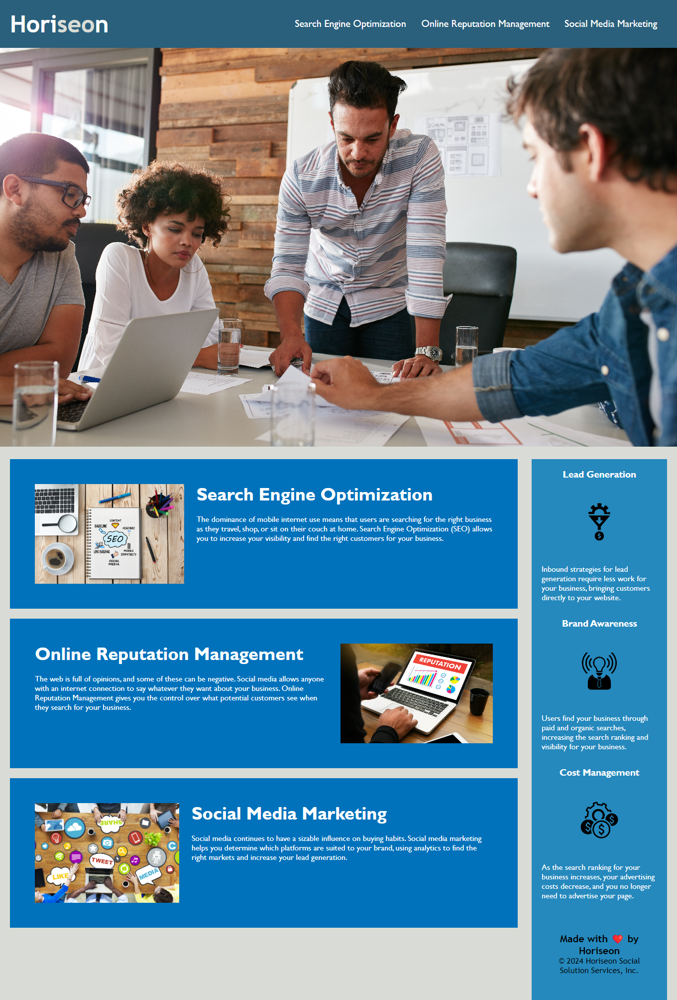

# 01 Challenge: Horiseon Homepage

## Description

Tweaked website of the client company, Horiseon

## Improvements

HTML
1. Titled Website
2. Replaced divs with semantics for each element with appropriate setting
3. Added Alternate text for images

CSS
1. Replaced divs with semantics for each element with appropriate setting
2. Rewrote code for effeciency

## User Story

```
AS A marketing agency
I WANT a codebase that follows accessibility standards
SO THAT our own site is optimized for search engines
```

## Mock-Up

The following image shows the web application's appearance and functionality:




## Deployed application

https://joshua-peraza.github.io/horiseon-refactor/